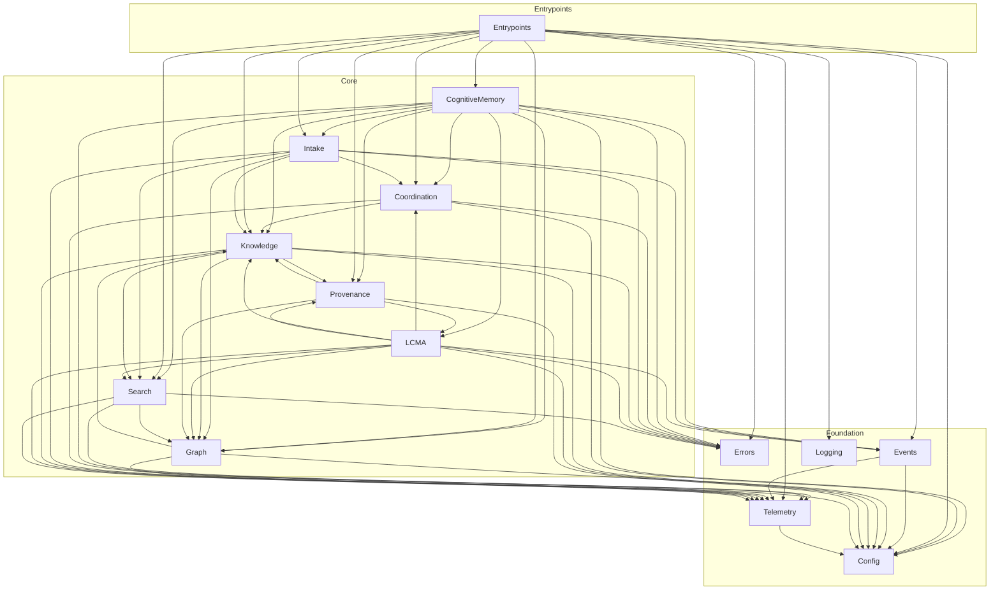

<!-- AUTOGENERATED by tests/guardrail — do not edit by hand.
     Regenerate with `make diagrams` (or `pytest tests/guardrail`). -->

# Component dependencies

```mermaid
graph TD
  subgraph tier_Core["Core"]
    CognitiveMemory
    Coordination
    Graph
    Intake
    Knowledge
    LCMA
    Provenance
    Search
  end
  subgraph tier_Entrypoints["Entrypoints"]
    Entrypoints
  end
  subgraph tier_Foundation["Foundation"]
    Config
    Errors
    Events
    Logging
    Telemetry
  end
  CognitiveMemory --> Config
  CognitiveMemory --> Coordination
  CognitiveMemory --> Errors
  CognitiveMemory --> Events
  CognitiveMemory --> Graph
  CognitiveMemory --> Intake
  CognitiveMemory --> Knowledge
  CognitiveMemory --> LCMA
  CognitiveMemory --> Provenance
  CognitiveMemory --> Search
  CognitiveMemory --> Telemetry
  Coordination --> Config
  Coordination --> Errors
  Coordination --> Knowledge
  Coordination --> Telemetry
  Entrypoints --> CognitiveMemory
  Entrypoints --> Config
  Entrypoints --> Coordination
  Entrypoints --> Errors
  Entrypoints --> Events
  Entrypoints --> Graph
  Entrypoints --> Intake
  Entrypoints --> Knowledge
  Entrypoints --> Logging
  Entrypoints --> Provenance
  Entrypoints --> Search
  Entrypoints --> Telemetry
  Events --> Config
  Events --> Telemetry
  Graph --> Config
  Graph --> Knowledge
  Graph --> Telemetry
  Intake --> Coordination
  Intake --> Errors
  Intake --> Events
  Intake --> Graph
  Intake --> Knowledge
  Intake --> Search
  Intake --> Telemetry
  Knowledge --> Config
  Knowledge --> Errors
  Knowledge --> Graph
  Knowledge --> Provenance
  Knowledge --> Search
  Knowledge --> Telemetry
  LCMA --> Config
  LCMA --> Coordination
  LCMA --> Errors
  LCMA --> Events
  LCMA --> Graph
  LCMA --> Knowledge
  LCMA --> Provenance
  LCMA --> Search
  LCMA --> Telemetry
  Provenance --> Config
  Provenance --> Graph
  Provenance --> Knowledge
  Provenance --> LCMA
  Search --> Config
  Search --> Errors
  Search --> Graph
  Search --> Telemetry
  Telemetry --> Config
```
