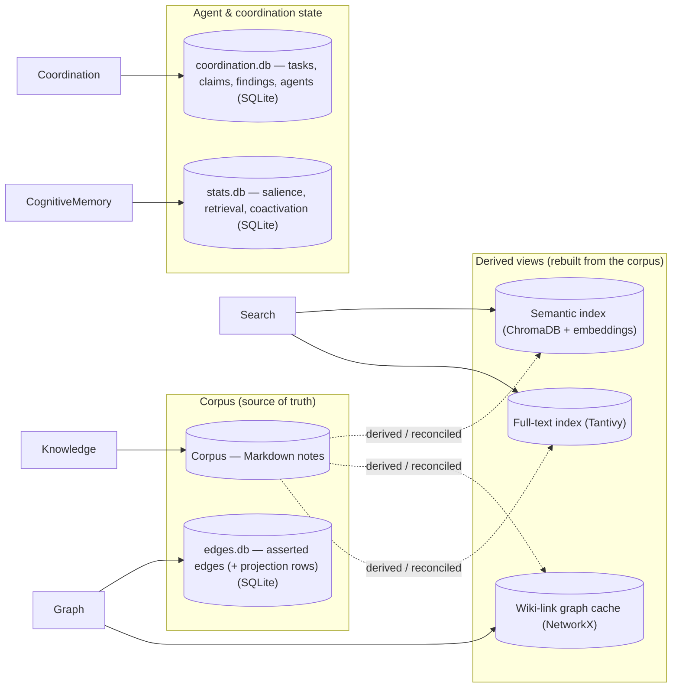

<!-- AUTOGENERATED by tests/guardrail — do not edit by hand.
     Regenerate with `make diagrams` (or `pytest tests/guardrail`). -->

# Data stores

On-disk stores and external engines, with the component that owns each. The corpus is the source of truth; derived views are rebuilt from it (dashed = derived / reconciled); agent & coordination state stands alone. Declared in `docs/architecture.toml` `[containers]`, anchored to `StorageConfig`.

